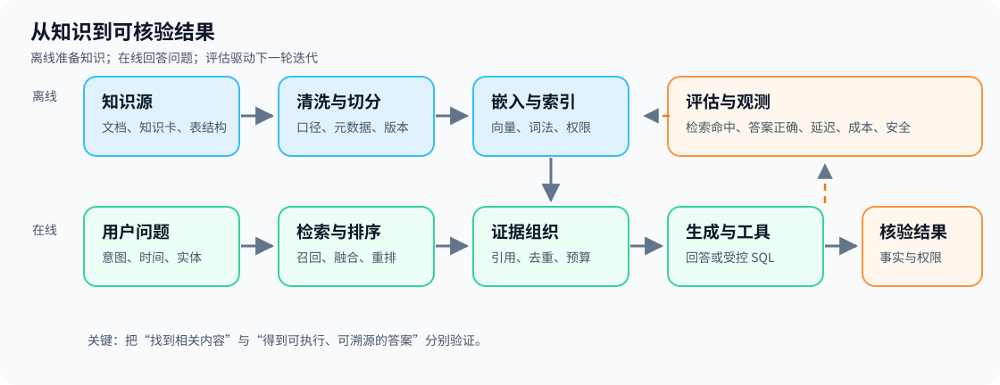

# RAG 工程落地：从业务知识到可审计的 Agent

本教程面向已有 Python 和大语言模型基础的智能体（Agent）开发者。以仓库中的中文电商自然语言转结构化查询语言（SQL, Structured Query Language）项目为贯穿案例，同时比较文档问答、混合检索、结构化数据查询、图谱与多跳检索等方案。建议按顺序运行，每章末尾都有基础与进阶练习。

**检索增强生成（RAG, Retrieval-Augmented Generation）**不是单个模型：它是一条将可信外部知识送进生成步骤、再验证结果的工程链。第一遍学习只需要离线运行的单元格；需要 PostgreSQL、Qwen 或 DeepSeek 的实验都标为可选。



## 阅读路线

| 章节 | 核心问题 | 离线可运行内容 |
|---|---|---|
| [00 学习路线](00_学习路线.ipynb) | 什么时候需要 RAG；工程链有哪些关口？ | 最小证据选择实验 |
| [01 知识准备与切分](01_知识准备与切分.ipynb) | 知识卡、文本块、元数据如何设计？ | 读取本项目的 `knowledge.json` |
| [02 嵌入与索引](02_嵌入与索引.ipynb) | 向量、相似度、增量索引如何工作？ | 哈希与索引更新模拟 |
| [03 检索与融合](03_检索与融合.ipynb) | 词法、向量、重排序与融合怎么选？ | 调用项目的 `lexical_score`、`rrf_rank` |
| [04 生成与高级 RAG](04_生成与高级RAG.ipynb) | 怎样组织证据、引用和拒答；何时分解问题？ | 带引用的上下文组装与多跳模拟 |
| [05 评估与安全](05_评估与安全.ipynb) | 如何证明效果与守住权限边界？ | 计算召回率与检查证据绑定 |
| [06 本项目 Agent 与 SQL](06_本项目Agent与SQL.ipynb) | RAG 如何服务自然语言转 SQL？ | 检查知识卡、SQL 校验器与工具契约 |
| [07 部署运维与综合实践](07_部署运维与综合实践.ipynb) | 如何从演示走到可观测、可迭代的服务？ | 更新策略与综合设计题 |

## 环境与运行

在**项目根目录**运行：

```powershell
uv sync --extra dev
uv run python -m ipykernel install --prefix .venv --name nl2sql-rag --display-name "Python (nl2sql-rag)"
uv run jupyter lab tutorial
```

在 Notebook 的 **Kernel → Change Kernel** 中选择 **Python (nl2sql-rag)**。若看到 `ModuleNotFoundError: No module named 'psycopg'`，先在单元格中运行 `import sys; print(sys.executable)`：它应指向本项目的 `.venv`，而不是其他 Python 环境。重建 `.venv` 后需重新注册内核。Notebook 中的路径查找兼容从项目根目录或 `tutorial/` 启动；如果将 Notebook 单独复制出仓库，项目代码示例将找不到源文件。Python 版本要求见根目录的 `pyproject.toml`（当前为 3.12–3.13）。

可选的完整项目链需要先在根目录按顺序执行：

```powershell
docker compose up -d db
uv run python -m nl2sql.migrate
uv run python -m nl2sql.seed
uv run python -m nl2sql.indexer
uv run adk web .
```

索引步骤需要 `QWEN_API_KEY` 或 `DASHSCOPE_API_KEY`；Agent 对话还需要 `DEEPSEEK_API_KEY`。请在本地环境或根目录 `.env` 中设置，**不要写入 Notebook**。可选在线单元格需手动开启开关，可能产生模型调用费用。离线章节不会修改数据库。

## 学习时抓住三个边界

1. **知识边界**：同一句“销售额”可能指支付金额、商品明细金额或扣退款的净额。先定义口径，再选检索单位。
2. **证据边界**：检索命中不等于答案正确；引用必须能回到具体知识卡、表字段或实际查询结果。
3. **权限边界**：外部文档属于数据，不能变成系统指令；模型生成的 SQL 必须经校验、最小权限与资源限制。

本教程中的小型离线演示用于解释机制，不能替代真实语料上的相关性标注、性能测试和安全测试。项目内 `tests/` 提供进一步的单元测试、数据库集成测试和 Agent 工具轨迹评估。

## 一手参考资料

- [Lewis 等：Retrieval-Augmented Generation for Knowledge-Intensive NLP Tasks](https://arxiv.org/abs/2005.11401)
- [pgvector 官方文档](https://github.com/pgvector/pgvector)
- [Google Agent Development Kit 官方文档](https://google.github.io/adk-docs/)
- [RAGAS 评估论文](https://arxiv.org/abs/2309.15217)

各章还列出与该章内容直接相关的论文或官方文档。资料帮助理解设计选择；具体 API 以本仓库的代码与锁定依赖为准。
